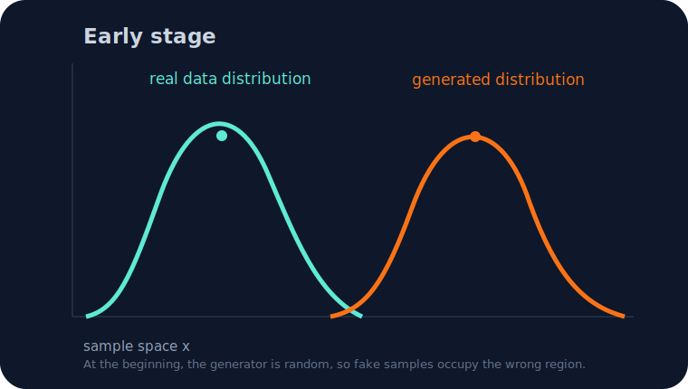
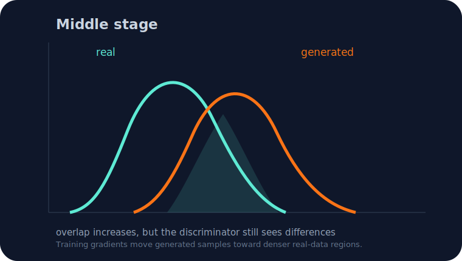
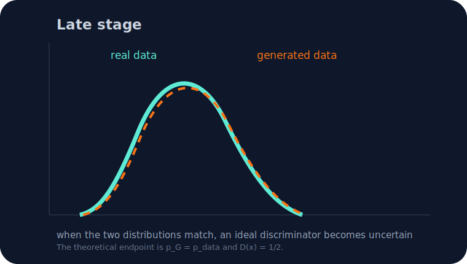
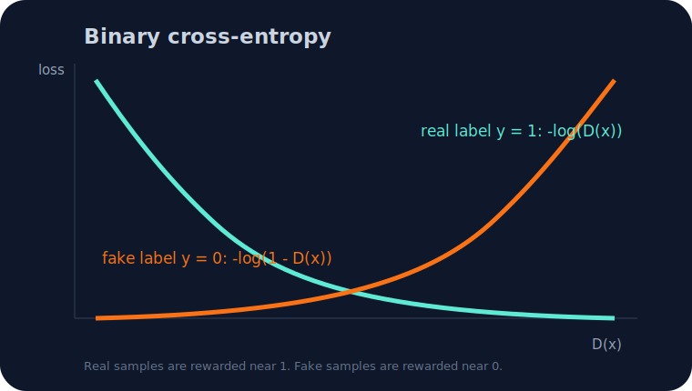
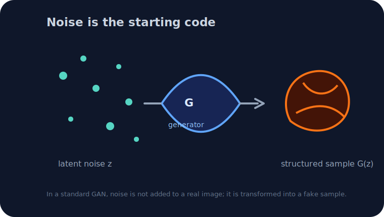

# GANs Step by Step: Distributions, 1/0 Labels, and Noise

This note is my attempt to make GANs feel less mysterious. The main questions are:

1. What does it mean that GAN training gradually matches distributions?
2. What are the `1` and `0` labels used by the discriminator?
3. Where does the random noise enter the model?
4. Why do people mention Jensen-Shannon divergence in the original GAN paper?

The short version: a GAN does not learn by copying one real image. It learns a generated distribution that should eventually look like the real-data distribution.

## 1. What distributions are we trying to match?

Assume real samples come from an unknown real-data distribution:

```text
x ~ p_data(x)
```

The generator starts from a random latent vector:

```text
z ~ p_z(z)
```

and maps it into a generated sample:

```text
x_fake = G(z)
```

Because `z` is random, the outputs of `G` also form a distribution:

```text
x_fake ~ p_G(x)
```

So the training goal is not “make one fake image equal one real image.” The goal is:

```text
p_G(x) ≈ p_data(x)
```

That means the overall population of generated samples should occupy the same kinds of regions as the real data.

## 2. What does gradual distribution matching look like?

At the beginning, the generator is almost random. Its generated distribution may be in the wrong place, have the wrong shape, or cover only a small part of what real data can look like.



During training, the discriminator learns where real and fake samples differ. The generator uses that signal to move future fake samples toward regions that look more realistic.



Late in training, if things go well, the generated distribution becomes close to the real-data distribution. At this point, the discriminator should become uncertain because fake and real samples are difficult to separate.



For a fixed generator, the optimal discriminator is:

```text
D*(x) = p_data(x) / (p_data(x) + p_G(x))
```

This is a useful equation to remember:

- if `p_data(x)` is much larger than `p_G(x)`, then `D*(x)` is close to `1`;
- if `p_G(x)` is much larger than `p_data(x)`, then `D*(x)` is close to `0`;
- if the two distributions are equal, then `D*(x) = 1/2`.

So the discriminator is not just a “real/fake judge.” In the idealized mathematical view, it tells us which distribution dominates at each location.

## 3. What is the “1 and 0 thing”?

The discriminator is trained like a binary classifier.

```text
real sample -> y = 1
fake sample -> y = 0
```

If the discriminator outputs:

```text
p_hat = D(x)
```

then `D(x)` means “the predicted probability that this sample is real.”

The binary cross-entropy loss is:

```text
L(y, p_hat) = -[ y log(p_hat) + (1-y) log(1-p_hat) ]
```

For a real sample, `y = 1`, so:

```text
L = -log(p_hat)
```

This becomes small only when `p_hat` is close to `1`.

For a fake sample, `y = 0`, so:

```text
L = -log(1 - p_hat)
```

This becomes small only when `p_hat` is close to `0`.



This is the full meaning of the `1` and `0` labels:

- `1` means real;
- `0` means fake;
- the discriminator learns to output values close to those labels;
- the generator tries to make fake samples receive a discriminator output close to `1`.

## 4. The original GAN objective

The original GAN paper defines the training objective as a minimax game:

```text
min_G max_D V(D, G)
```

where:

```text
V(D, G)
= E_{x ~ p_data}[log D(x)]
+ E_{z ~ p_z}[log(1 - D(G(z)))]
```

The discriminator tries to maximize this value by correctly classifying real and fake samples.

The generator tries to minimize it by making `D(G(z))` large, meaning the discriminator thinks generated samples are real.

In practice, many implementations use the non-saturating generator loss:

```text
L_G = - E_{z ~ p_z}[log D(G(z))]
```

This often gives stronger gradients early in training.

## 5. How does the generator move the distribution?

The generator has parameters, usually written as `theta_G`. A gradient update looks like:

```text
theta_G <- theta_G - eta * grad_{theta_G} L_G
```

For the non-saturating loss:

```text
L_G = -log D(G(z))
```

the gradient flows through the discriminator output and then through the generator:

```text
grad_{theta_G} D(G(z))
= [partial D(x) / partial x] at x = G(z)
  * [partial G(z) / partial theta_G]
```

Intuitively:

- the discriminator says which changes would make a fake sample look more real;
- backpropagation transfers that signal into the generator weights;
- future generated samples shift toward more realistic regions.

That is why people say the generator distribution is gradually reshaped during training.

## 6. Where is the noise added?

In the original GAN setup, the random noise is sampled first:

```text
z ~ N(0, I)
```

or sometimes:

```text
z ~ U(-1, 1)
```

This noise vector is the generator input:

```text
z -> G(z) -> x_fake
```



Different noise vectors produce different fake samples:

```text
z_1 -> G(z_1)
z_2 -> G(z_2)
```

The important point: in a standard GAN, noise is not usually added onto a real image. It is the starting code that the generator transforms into a structured sample.

In conditional GANs, the generator may receive both noise and a condition:

```text
G(z, c)
```

where `c` could be a class label, a segmentation mask, or another image. In image-to-image translation tasks, the explicit noise term is sometimes omitted or made implicit because the task needs a more stable mapping.

## 7. Why is Jensen-Shannon divergence mentioned?

The original GAN paper shows that if the discriminator is optimal, then the generator is related to minimizing the Jensen-Shannon divergence between the real and generated distributions:

```text
V(D*, G) = -log(4) + 2 JS(p_data || p_G)
```

So the formal mathematical story is:

- the discriminator estimates how real and generated distributions differ;
- the generator changes to reduce that difference;
- under the ideal assumptions, the global optimum is reached when:

```text
p_G = p_data
```

At that point:

```text
D*(x) = 1/2
```

The discriminator cannot do better than guessing.

## 8. Medical imaging reminder

For medical images, “looks realistic” is not enough. A generated CT or MRI image may look visually plausible but still fail to preserve anatomy, pathology, acquisition characteristics, or quantitative measurements.

Useful checks may include:

- image quality and artifacts;
- anatomical plausibility;
- distributional similarity;
- diversity and mode collapse;
- privacy risk;
- performance on a downstream segmentation, classification, or measurement task;
- expert review when the task is clinically meaningful.

This is why GAN evaluation in medical imaging should be tied to the actual scientific or clinical purpose, not only to pretty images.

## 9. Final short summary

A GAN trains two networks in opposition:

- the generator turns random noise into fake samples;
- the discriminator learns to output `1` for real and `0` for fake;
- the discriminator’s gradients guide the generator;
- over training, the generated distribution `p_G` should move closer to the real distribution `p_data`;
- in the ideal case, the two distributions match and the discriminator outputs `1/2`.

That is the mathematical meaning of successful GAN training.

## References

- Goodfellow, I. J., Pouget-Abadie, J., Mirza, M., Xu, B., Warde-Farley, D., Ozair, S., Courville, A., & Bengio, Y. (2014). [Generative Adversarial Nets](https://arxiv.org/abs/1406.2661). NeurIPS.
- Arjovsky, M., Chintala, S., & Bottou, L. (2017). [Wasserstein GAN](https://arxiv.org/abs/1701.07875).
- Heusel, M., Ramsauer, H., Unterthiner, T., Nessler, B., & Hochreiter, S. (2017). [GANs Trained by a Two Time-Scale Update Rule Converge to a Local Nash Equilibrium](https://arxiv.org/abs/1706.08500).
